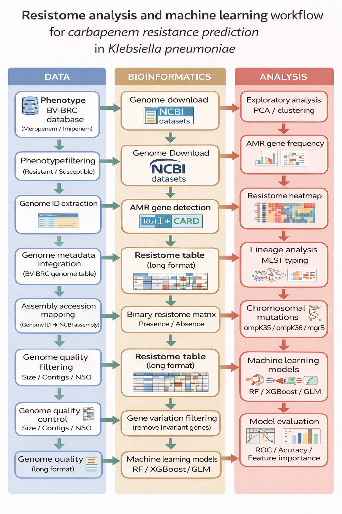

# Resistome Analysis of *Klebsiella pneumoniae* Associated with Carbapenem Resistance

**Master Thesis – Leslie Barrios**

## Overview

This project investigates the genomic determinants associated with resistance to carbapenems in *Klebsiella pneumoniae*, focusing on two clinically relevant antibiotics:

- **Meropenem**
- **Imipenem**

The study integrates:

- Phenotypic antimicrobial susceptibility data
- Whole genome sequences
- Resistome profiles inferred using the **CARD database**

Machine learning models are used to evaluate the predictive capacity of genomic resistance determinants for antimicrobial resistance phenotypes.

## Bioinformatic Workflow



## Pipeline Overview

1. Retrieval of phenotypic data from **BV-BRC**
2. Genome metadata integration and assembly mapping
3. Genome quality filtering
4. Genome download from **NCBI**
5. ORF prediction with **Prodigal**
6. Identification of AMR genes using **RGI (CARD)**
7. Construction of resistome presence/absence matrix
8. Exploratory resistome analysis (PCA / clustering)
9. AMR gene frequency analysis
10. Resistome heatmap visualization
11. Principal Coordinate Analysis (PCoA)
12. Molecular typing and lineage analysis (MLST)
13. Machine learning models for resistance prediction
14. Model evaluation

## Project Structure

```
TFM_Leslie/
│
├── scripts/        # Reproducible analysis scripts
├── data/           # Raw and processed datasets
├── databases/      # AMR reference databases
├── results/        # Analysis outputs
├── figures/        # Figures generated for the thesis
│
├── README.md
├── PIPELINE.md
├── environment.md
└── install_packages.md
```

## Reproducibility

All analyses were performed using a reproducible bioinformatic pipeline available in the **scripts/** directory.

The complete workflow is described in:

**PIPELINE.md**


## Environment

To reproduce this analysis see:

- **environment.md** → Conda environment and bioinformatics tools
- **install_packages.md** → R package installation

## Author

**Leslie Barrios**  
Master's Program in Bioinformatics
