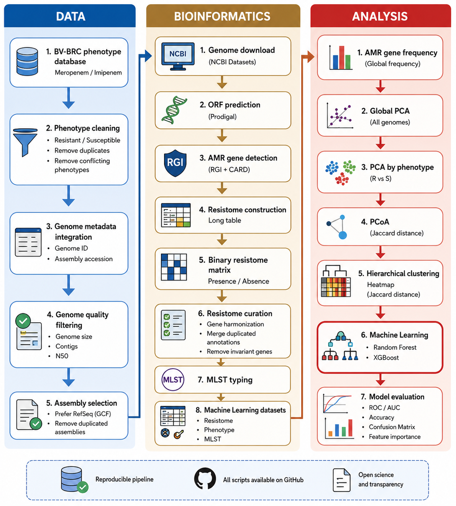

# Resistome Analysis and Machine Learning Prediction of Antimicrobial Resistance in *Klebsiella pneumoniae* 

**Master Thesis – Leslie Barrios**

## Overview

This repository contains the complete bioinformatic and machine learning workflow developed for the Master's Thesis:

**Prediction of antimicrobial resistance phenotype in Klebsiella pneumoniae using machine learning models   based on genomic data.**

The study integrates antimicrobial susceptibility data, whole-genome assemblies, resistome profiling and molecular typing to predict resistance to carbapenems using supervised machine learning.

## Objectives:
- Characterize the resistome of clinical Klebsiella pneumoniae isolates;
- Identify the frequency and distribution of antimicrobial resistance determinants;
- Evaluate the global structure of the resistome using multivariate analyses;
- Assess lineage diversity through MLST;
- Predict antimicrobial resistance phenotypes using Random Forest and XGBoost models.

## Bioinformatic Workflow



## Workflow Summary
**Data acquisition**
BV-BRC phenotype database
Meropenem
Imipenem

**Genome processing**
Assembly mapping
Quality filtering
Genome download (NCBI Datasets)

**Bioinformatic analysis**
ORF prediction (Prodigal)
AMR gene detection (RGI + CARD)
Resistome construction
Resistome curation
MLST typing

**Exploratory analyses**
AMR gene frequency
Global PCA
PCA by phenotype
PCoA
Hierarchical clustering

**Machine Learning**
Random Forest
XGBoost

**Model evaluation**
ROC
AUC
Confusion Matrix
Feature importance

## Project Structure

```
TFM_Leslie/
│
├── scripts/        # Reproducible analysis scripts
├── data/           # Raw and processed datasets
├── results/        # Analysis outputs
├── figures/        # Figures generated for the thesis
│
├── README.md
├── PIPELINE.md
├── environment.md
└── install_packages.md
```

## Reproducibility

All analyses were performed using a reproducible bioinformatic pipeline available in the **scripts/** directory.

The complete workflow is described in **PIPELINE.md**


## Environment

To reproduce this analysis see:

- **environment.md** → Conda environment and bioinformatics tools
- **install_packages.md** → R package installation

## Author

**Leslie Barrios**  
Master's Degree in Bioinformatics
